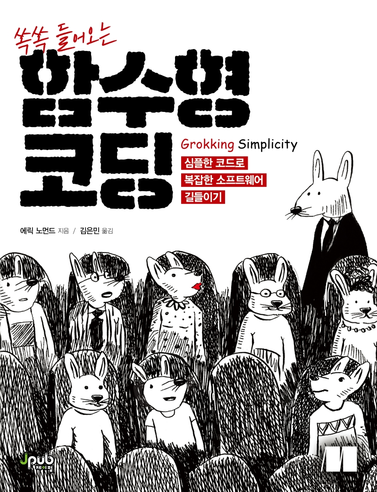

# 쏙쏙 들어오는 함수형 코딩

[쏙쏙 들어오는 함수형 코딩](http://www.kyobobook.co.kr/product/detailViewKor.laf?ejkGb=KOR&mallGb=KOR&barcode=9791191600759&orderClick=LEa&Kc=#N)을 공부하고 정리하는 스터디 입니다.

### 📄 규칙

- 매주 챕터 2-3개를 학습하고, ~~2명이 발표합니다.~~ 공감 가는 내용 공유 및 토론으로 변경(08/31)
- 발표 전날 자정까지 정리한 자료를 PR 보냅니다.

### 📆 일정

| 챕터 | 일자 | 자료 |
| :-: | :-: | :-: |
| 챕터 1-3 | 2022/07/31(일) 11:00 | 호준([챕터 1](/chapter/chapter1/README.md), [챕터 2](/chapter/chapter2/README.md)), 재욱([챕터 3](/chapter/chapter3/README.md)) |
| 챕터 4-5 | 2022/08/18(목) 20:30 | 현구([챕터 4](/chapter/chapter4/README.md)), 정원([챕터 5](./chapter/chapter5/README.md)) |
| 챕터 6-8 | 2022/08/24(수) 21:00 | 호준([챕터 6](/chapter/chapter6/README.md)), 재욱([챕터 7](./chapter/chapter7/README.md)), 현구([챕터 8](/chapter/chapter8/README.md)) |
| 챕터 9-10 | 2022/08/31(수) 20:30 | [챕터9](/chapter/chapter9/README.md), [챕터10](/chapter/chapter10/README.md) |
| 챕터 11-12 | 2022/09/07(수) 20:30 | [챕터11](/chapter/chapter11/README.md), [챕터12](/chapter/chapter12/README.md) |

### 👨‍👨‍👦‍👦 참여자

- [@newgardener](https://github.com/newgardener)
- [@mugglim](https://github.com/mugglim)
- [@kukucorn](https://github.com/kukucorn)
- [@jihoho](https://github.com/jihoho)
