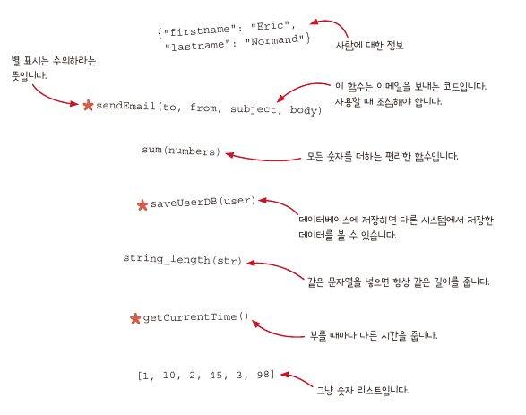
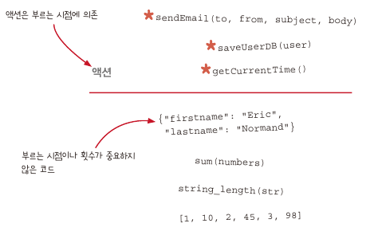
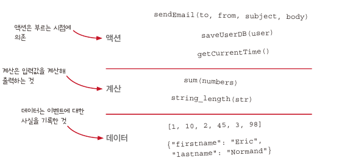
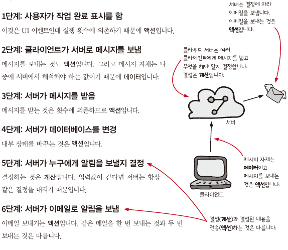

# 함수형 프로그래밍(Functional programming, FP)

<aside>
💡  
  1. 수학 함수를 사용하고 <b>부수효과(side effect)</b>를 피하는 것이 특징인 프로그래밍 패러다임  
  2. 부수 효과 없이 <b>순수함수</b>만 사용하는 프로그래밍 스타일  

</aside>

## 부수효과

- 리턴 값 외에 하는 모든일
    - 메일보내기나 전역 상태를 수정하는 것
- 리턴 값이 필요해서 불렀지만 의도치 않게 부수효과를 발생할 수 있음.

## 순수 함수

- 인자에만 의존하고 부수효과가 없는 함수.
    - 같은 인자를 넣으면 항상 같은 결과를 돌려준다는 말
- 수학 함수

## 실용적인 측면에서 함수형 프로그래밍 정의의 문제점

### 문제 1: 부수효과는 필요하다.

- 필요할 때는 부수 효과를 써야 한다.

### 문제 2: 함수형 프로그래밍은 부수 효과를 잘 다룰 수 있다.

- 부수 효과를 잘 다루기 위한 도구를 많이 알고 있음.
- 순수 하지 않은 함수를 잘 다룰 수 있는 기술이 많이 있음.

### 문제 3: 함수형 프로그래밍은 실용적이다.

- 실제로 함수형 프로그래밍 기반으로 잘 만들어진 좋은 소프트웨어가 많다.

## 함수형 프로그래밍 정의가 혼란스러운 관리자

## 함수형 프로그래밍을 학문적 지식이 아닌 기술과 개념을 보기

- 함수형 프로그래밍은 많은 사람이 서로 다른 의미로 생각한다.
- 또 학술적으로도 실용적으로도 많은 내용이 있음.
- 이 책에는 함수형 프로그래밍을 쓰고 있는 프로그래머가 가진 기술과 생각의 흐름, 시각이 정리가 되어 있음.
- 함수형 프로그래밍에 관한 학술적인 최신 연구 자료나 난해한 개념을 뺏다.
- 함수형 프로그래밍의 중요한 개념은 객체지향 프로그래밍이나 절차적 프로그래밍을 가리지 않고 모든 프로그래밍 언어에서 쓸 수 있다는 것

## 액션과 계산, 데이터 구분하기

---

---

## 프로젝트 관리를 위한 클라우드 서비스 (간단한 시나리오)

### 각 분류에 해당하는 특징

### 1. 액션

- 실행 시점이나 횟수 또는 둘 다에 의존
    - 같은 메일을 10번 보내는 것과 한 번 보내는 것 또는 보내지 않는 것은 다름.

### 2. 계산

- 같은 입력값을 가지고 계산하면 항상 같은 결과 값
- 언제 어디서 계산해도 결과는 같고 외부에 영향을 주지 않음.
- 테스트 하기 쉽고 언제 든지 몇번을 불러도 안전

### 3. 데이터

- 이벤트에 대해 기록한 사실
- 실행하지 않아도 데이터 자체로 의미

## 액션, 계산, 데이터를 구분 장점

- 분산 시스템에 잘어울림.
- 여러 컴퓨터가 네트워크 통신하기 시작하면 소프트웨어가 복잡해짐.
    - 처리해야할 메시지는 **순서가 섞일 수** 있고, **중복**되기도 하고 **유실**되기도 함.
    - 시간에 따라 바뀌는 값을 모델링 할때 동작 방법을 이해하는 것은 중요하지만 쉽지 않음.
- **액션**를 **데이터와 계산**으로 바꿀 수록 분산 시스템에서 생기는 여러가지 문제를 해결 할 수 있음.
- **액션은** 실행 시점과 횟수에 의존하기 때문에 코드 전체에 영향을 주지 않도록 **격리** 시키면 됨.
- 코드의 많은 부분을 액션에서 계산으로 옮기면 결과적으로 액션도 다루리기 쉬워지고, **액션을 안전하게 다룰 수 있는 기술**이 있기 때문에 안심 할 수 있음.
  
    

## 함수형 사고

<aside>
💡 함수형 프로그래머가 소프트웨어 문제를 해결하기 위해 사용하는 기술과 생각을 말함.

</aside>

1. 액션과 계산, 데이터를 구분해서 생각하는 것
2. 일급 추상(first-class abstraction)
    - 재사용을 위해 더 일반적인 이름을 짓기 위해 고민
    - 함수에서 함수를 넘겨 더 많은 함수를 재사용
    - 이것을 어떻게 쓰고 남용하지 않으려면 어떻게 해야 하는지?
    - 일급
        - 값으로써 다룰 수 있다
        - 변수에 담을 수 있음.
        - 함수의 인자로 사용될 수 있음. (parameter)
        - 함수의 결과로 사용될 수 있음. (return값)