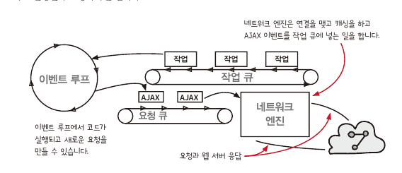

# CHAPTER 14-15

**chapter 14** 중첩된 데이터에 함수형 도구 사용하기

**chapter 15** 타임라인 격리하기 


### **공감가는 내용**

- 중첩되어 있는 객체의 값 변경 시 `nestedUpdate()`를 통해 불변성을 보장 (카피-온-라이트의 반복 과정)
- 재귀가 깊어지는 경우, 각 카피-온-라이트를 별도의 함수(계산)으로 빼내는 과정 👍👍
- 액션을 타임라인화 하는 과정에서, 언어마다 액션의 크기를 다르게 바라보는 방식
    - 자바스크립트는 이벤트루프를 통해 비동기 콜백을 제외하고 하나의 액션이라고 바라볼 수 있음
- 반복문과 재귀는 서로 잘 표현할 수 있는 코드가 다르다. 반복문은 forward한 것을, 재귀는 revert한 것을 잘 표현한다.
- 재귀 함수 호출로 중첩된 구조를 개선하는 부분
- 반복문의 경우 스택을 직접 관리 해야 하지만, 재귀 호출의 경우 리턴 받는 곳에서 기존의 인잣값을 스택으로 유지 할 수 있다.
- 비동기 콜백의 실행 순서를 타임라인 다이어그램을 통해 공유 자원을 확인하고 없애는 과정

### **공유하고 싶은 내용**

- 중첩 객체를 카피-온-라이트 처리하는 과정에서 [immer.js](https://github.com/immerjs/immer)의 구현체가 궁금해졌습니다. (시간되면 한 번 파보고 공유해보겠습니다)
    - [https://immerjs.github.io/immer/update-patterns#nested-data-structures](https://immerjs.github.io/immer/update-patterns#nested-data-structures)
    - [https://hmos.dev/deep-dive-to-immer](https://hmos.dev/deep-dive-to-immer)
    - [https://meetup.toast.com/posts/327](https://meetup.toast.com/posts/327)
      
        ```tsx
        import produce from 'immer';
        
        const obj = {a1: {b1: 1}, a2: {b2: 2}, a3: {b3: 3}};
        const newObj = produce(obj, (draft) => {
        	// draft : copy
        	
        	// modify
          draft.a2.b2 = 4;
        	
        	// return draft
        });
        
        console.log(obj === newObj); // false
        console.log(obj.a1 === newObj.a1); // true
        console.log(obj.a2 === newObj.a2); // false
        console.log(obj.a3 === newObj.a3); // true
        ```
        

### **얘기해보고 싶은 내용**

- `++`와 `+=`는 하나의 연산자이지만, 복합적인 액션으로 되어 있다고 한다.(읽기, 계산, 쓰기) 이러한 과정이 JS에서도 문제가 될 수 있나??
    - 호준: 멀티스레드 환경인 java에서는 다른 스레드 간의 실행 순서가 얽힐 수 있기 때문에 문제가 생기지만 (synchronized 키워드 사용 시 동기적 처리 가능)
    - Thread Safety in Signleton Pattern
      
        [Single ton](https://www.notion.so/Single-ton-230d8f6d751b48d19a328b6893b10b47)
    
- async&await 사용시 콜백 함수가 요청 큐가 아닌 작업큐에 쌓이는 가?
  
    
    

```tsx
const takeTask1 = async() => {
	await task1();    
	await task2();
	await task3();
}

const takeTask2 = async() => {
	await task1();
  await task2();
	await task3();
}

// 요청 큐 
```

- 콜백 함수, 비동기 이벤트를 처리하기 위한 테스트를 어디까지 진행해야 하는지 (도구?, 액션에 대한 테스트)
    - 단위 테스트로 커버 하기 어려운 경우 통합 테스트(E2E 테스트)를 통해 시나리오를 테스트

### **궁금한 내용**

- 메시지 패싱 프로세스란 뭘까? 엘릭서나 얼랭 같은 언어가 서로 다른 프로세스를 동시에 실행할 수 있는 스레드 모델을 지원한다고 한다. 403p
    - IPC 비용은 낮고, 메모리는 독립적으로 (공유하는 자원이 없음.)