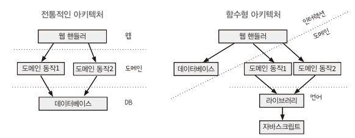
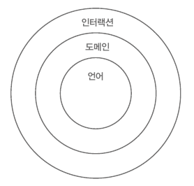
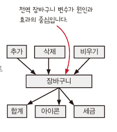

# CHAPTER 18/19

- **CHAPTER 18** 반응형 아키텍처와 어니언 아키텍처
- **CHAPTER 19** 함수형 프로그래밍 여행에 앞서

### **공감가는 내용**

- 재욱
  - 반응형 프로그래밍을 통한 타임라인 간소화 및 중복 제거
  - 반응형 프로그래밍 파트에서 언급한 Recoil의 atom과 Selector
- 호준

  - ValueCell에 감시자 개념을 추가 하여 반응형으로 개선(옵저버, 프록시 패턴과 유사)
  - 장바구니가 바뀔 때 기능을 추가할때, 장바구니를 바꾸는 모든 코드를 고쳐야 하는 문제를 원인과 효과 decoupling 하여 개선할 수 있음.
  - 의문이었던 전통적인 계층형 아키텍처의 경우 DB 계층이 가장 아래, 함수형 아키텍처의 경우 DB나 API 호출을 가장 높은 계층에서 관리
    - 도메인 규칙에서 데이터베이스 사용해야 한다면??
    - 웹 핸들러에서 DB조회와 도메인 계산을 사용해야 함.
      
      

- 현구

  - 감시자(watcher), 이벤트 핸들러(event handler), 옵저버(observer), 콜백(callback), 리스너(listener) 모두 같은 개념을 나타내는 이름이다. 생각해 보니 닮았네..
  - 감시자를 하나 추가하면서 감시자를 사용하던 함수들에서 중복을 없앨 수 있게 되었다.
  - 반응형 아키텍쳐를 적용하면 n\*m을 n+m으로 바꿀 수 있다. 하지만, 항상 그렇게 되는 것은 아니고 **원인과 결과가 순차적이지 않을 때 적용 가능하다.**
    

### **다른 사람의 의견을 들어보고 싶은 내용**

- 어니언 아키텍쳐 with Functional Programming (잘 와닿지 않았음.)
