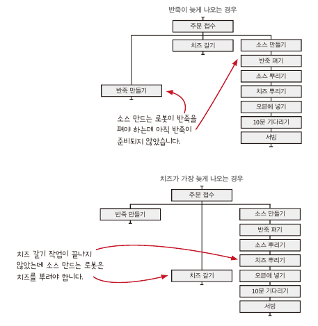

# chap02

<aside>
💡  
- 현실적인 문제를 함수형 사고에 적용  
- 소프트웨어 구조를 잡는 데 계층형 설계가 좋은 이유  
- 액션을 타임라인으로 시각화  
- 타임라인을 사용하여 시간에 관한 문제를 다뤄봄  
</aside>

</aside>

토니 피자라는 가게에서 로봇으로 피자를 만들고 있고, 여기에 함수형 사고를 적용했다고 가정

## 액션과 계산, 데이터

### 1. 액션

- 호출 횟수와 시점에 의존
- 오븐이나 배달차와 같은 자원과 요리 재료를 사용하는 것
- 반죽 펴기, 피자 배달, 재료 주문

### 2. 계산

- 어떤 것을 결정하거나 계획 하는 것
- 조리법에 나온 것을 두 배로 만들기
- 쇼핑 목록 결정

### 3. 데이터

- 변경 불가능한(immutable) 데이터를 가능한한 많이 쓰려고함.
- 결제, 재고, 피자 조리법 같은 것이 데이터
- 데이터는 유연하기 때문에 저장하거나 네트워크로 전송하는 등 다양하게 사용가능

## 변경 가능성에 따라 코드 나누기

- 자바 스크립트 언어 자체(배열이나 객체같은 언어 기능)는 바뀌지 않기 때문에 아래쪽
- 바뀔 수도 있지만 자주 바뀌지 않는 피자 조리에 대한 것은 가운데
- 가장 위쪽에는 이번 주 메뉴와 같이 자주 바뀌는 사업적인 내용
- 계층형 설계는 일반적으로 비지니스 규칙, 도메인 규칙, 기술 스택 계층으로 나눔.
    - 테스트, 재사용, 유지보수가 쉬움.

## 일급 추상

주방 자동화 하기

## 분산 시스템을 타임라인으로 시각화 하기

## 각각의 타임라인은 다른 순서로 실행

## 어려운 경험을 통해 분산 시스템에 대해 배운것

1. 기본적으로 타임라임은 서로 순서를 맞추지 않음.
    - 반죽이 준비되지 않앗는데 다른 타임라인은 그냥 진행되었음.
2. 액션이 실행되는 시간은 중요하지 않음.
    - 소스 만드는 것이 제일 오래걸리는 작업이지만 항상 그렇지 않음.
    - 각각의 타임라인은 다른 타임라인의 순서와 관계 없이 만들어야 함.
3. 드물지만 타이밍이 어긋나는 경우는 실제로 일어난다.
    - 테스트 할때 문제 없지만 실제 서비스에서 문제가 생김.
    - 타임라인은 항상 올바른 결과를 보장 해야 함.
4. 타임라인 다이어그램으로 시스템의 문제를 알 수 있음.
    - 다이어 그램을 보고 치즈가 제 시간에 준비되지 않을 것을 알았음.

## 타임라인 커팅: 로봇이 서로를 기다릴 수 있게 하기

- 타임라인 커팅은 여러 타임라인이 동시에 진행 될 때 서로 순서를 맞추는 방법
- 타임 라인 커팅은 **고차 동작**(고차 함수로 만든 동작)으로 구현 함.

1. 타임 라인 커팅으로 서로 다른 작업들을 쉽게 이해할 수 있음.
    - 동시에 할 수 있는 **재료 준비**와, 순서대로 해야하는 **피자 만들기**를 분리
2. 타임라인 다이어그램을 사용하면 시간에 따라 진행하는 작업을 쉽게 이해할 수 있음.
    - 분산 시스템을 시각화 하기 좋음.
3. 타임라인 다이어그램은 유연
    - 타임라인을 보고 쉽게 코드로 옮길 수 있음.
    - 타임라인 다이어그램을 동시에 진행되는 작업을 쉽게 모델링 할 수 있음.