# chapter 6 변경 가능한 데이터 구조를 가진 언어에서 불변성 유지하기

## 모든 동작을 불변형으로 만들수 있을까?

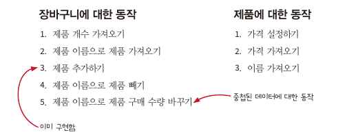

- 중첩된 데이터(nested data)에 대한 불변 동작을 구현해야 함.

## 동작을 읽기, 쓰기 또는 둘 다로 분류하기

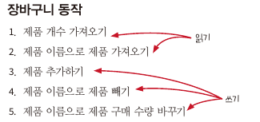


- read : 데이터에서 정보를 가져옴(데이터가 바뀌지 않음)
- write: 데이터를 바꿈.

## Copy On Write 원칙 3단계

1.  복사본 만들기
2. 복사본 변경하기
3. 복사본 리턴하기

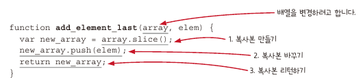

1. 배열을 복사
2. 복사본은 함수 범위에 있기 때문에 다른 코드에서 값을 바꾸기 위해 접근할 수 없음.
3. 복사본을 변경하고 나서 함수를 나감(return), 이후에는 값을 바꿀 수 없음.

## Copy On Write로 쓰기를 읽기로 변경

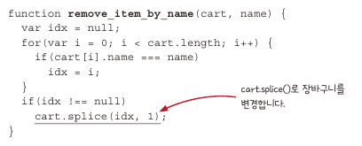

- 전역 변수인 shoping_cart를 전달하게 되면 전역 변수가 변경이 된다.

### 1. Copy on write 적용

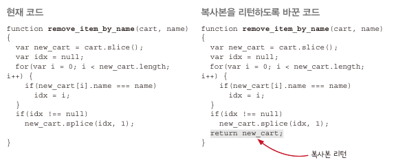

- **`var new_cart = cart.slice();`** : 복사본 만듬.
- **`new_cart.splice(idx,1)`** :복사본 변경
- **`return new_cart;` **: 복사본 return

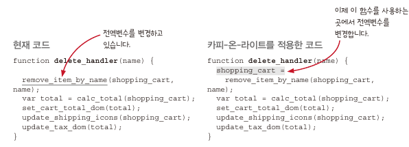

- return 값에 shopping_cart 전역 변수를 할당

### 2. 메서드 일반화

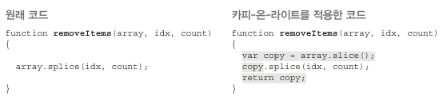

- **`.splice()`** 메서드를 일반화

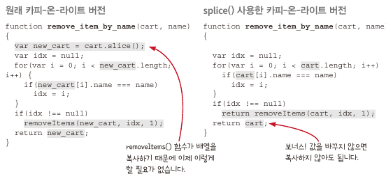

- 값을 바꾸지 않으면 복사할 필요가 없어짐.
- 배열이나 객체를 복사하는 코드 패턴을 재사용 가능 함.

---

## 쓰기를 하면서 읽기도 하는 동작

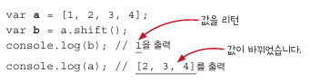

- **`.shift()`** 메서드는 값을 바꾸는 동시에 배열의 첫번째 항목을 return

### 두 가지 접근 방법

1. 읽기와 쓰기 함수로 각각 분리
2. 함수에서 값을 두 개 리턴

### 1. 읽기와 쓰기 동작으로 분리

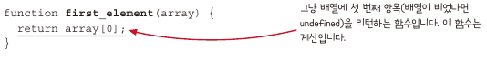

- 배열을 바꾸지 않는 함수

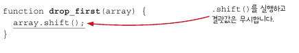

- **`.shift()`** 메서드의 return 값은 사용하지 않음.

**쓰기 동작을 카피-온-라이트 로 변경**


- 읽기와 쓰기 분리 접근 방법은 함수를 따로 쓸 수 있기 때문에 더 좋은 접근 방법임. (선택해서 쓸 수 있음)

### 2. 값을 두 개 리턴하는 함수로 만들기

**2-1.** **동작을 감싸기**


**2-2. 읽으면서 쓰기도 하는 함수를 읽기 함수로 바꾸기**

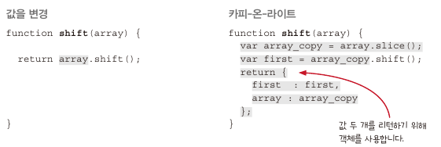

**다른 방법**

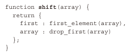

- 첫 번째 접근 방식을 사용해서 두 값을 객체로 조합하는 방법

---

## 불변 데이터 구조를 읽는 것은 계산 이다.

1. 변경 가능한 데이터를 읽는 것은 액션
2. 쓰기는 데이터를 변경 가능한 구조로 만듬.
3. 어떤 데이터 쓰기가 없다면 데이터는 변경 불가능한 데이터
4. 불변 데이터 구조를 읽는 것은 계산
5. 쓰기를 읽기로 바꾸면 코드에 계산이 많아짐.

## 애플리케이션에는 시간에 따라 변하는 상태가 있음.

- 모든 값을 불변형으로 만들더라도 시간에 따라 바뀌는 값을 다룰 수 있어야 함.

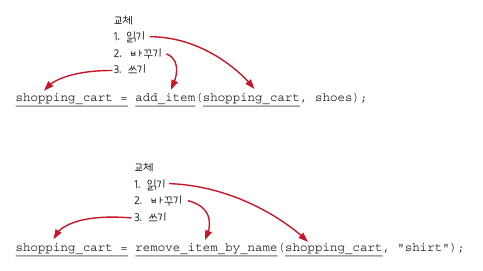

- 장바구니가 변경 될때 마다 shoping_cart 전역 변수에 새로운 값으로 교체 (swapping)
- shopping_cart 전역 변수는 항상 최신 값을 나타냄.

## 불변 데이터 구조는 충분히 빠름.

- 변경 가능한 데이터 구조 보다 메모리를 **더 많이 쓰고 느림.**

1. 언제든 최적화 할 수 있다.
2. 가비지 콜렉터는 매우 빠르다.
3. 생각보다 많이 복사하지 않는다.
    - 데이터 구조의 최상위 단계만 복사(얕은 복사, shallow copy)
    - **구조적 공유(structural sharing)**: 두개의 중첩된 구조가 어떤 참조를 공유하는 경우
    - 불변 데이터 구조라면 구조적 공유는 안전 함.
4. 함수형 프로그래밍 언어에는 빠른 구현체가 있음.

## 객체에 대한 카피온라이트


- 배열에서는 **`.slice()` **, 객체에서는 **`Object.assign()`**

제품 가격을 설정하는 set_price() 코드

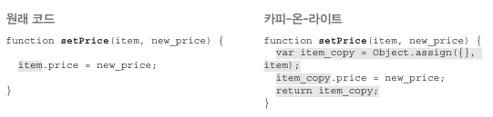

## 중첩된 쓰기를 읽기로 변경

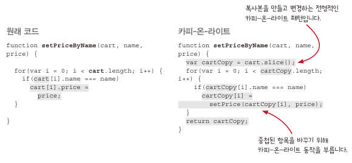

- 원래 코드처럼 항목을 직접 변경하면 불변 데이터가 아님.
    - 배열에 항목은 바뀌지 않지만 배열 항목이 참조하는 값은 바뀜
    - 중첩된 모든 데이터 구조가 바뀌지 않아야 불변 데이터라 할 수 있음.
- 중첩된 데이터 일부를 바꾸려면 상위의 모든 값을 복사하고, 변경 해야 함.

### 얕은 복사와 구조적 공유

- 장바구니에 티셔츠와 신발, 양말이 있다고 가정
- 티셔츠 가격을 13달러로 변경
  
    ```jsx
    shopping_cart = setPriceByName(shopping_cart, "t-sirt", 13);
    ```
    

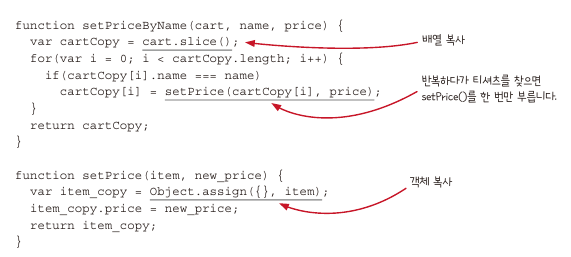

- 복사본은 배열 하나(장바구니)와 객체 하나(티셔츠)
- 나머지 신발과 양말에 대해 복사 하지않음.
    - **중첩 데이터에 얕은 복사**를 했기 때문에 구조적 공유가 됨.

---

### 구조적 공유 그림

1. 장바구니 배열과 제품 객체 3개 그림
   
    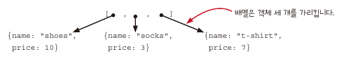
    
1. 장바구니의 얇은 복사본 생성
   
    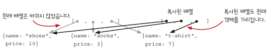
    
2. 반복문에서 티셔츠를 찾아 setPrice()함수를 통해 티셔츠 객체의 얇은 복사본 생성 및 가격을 13으로 변경
   
    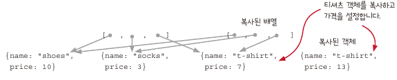
    
3. setPrice()함수의 복사본을 리턴하고, 티셔츠 객체는 복사본을 가리키도록 함.
   
    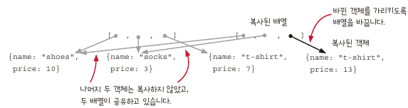
    

- 구조적 공유에서 공유된 복사본이 변경되지 않는한 안전하다.
- 값을 바꿀 때는 복사본을 만들기 때문에 공유된 값은 변경되지 않는다고 확신할 수 있음.

