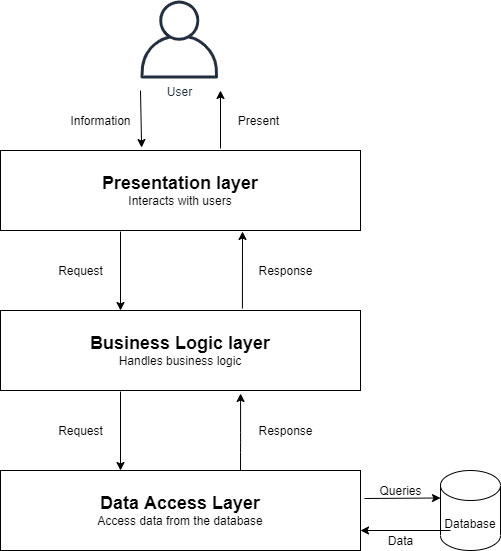

# Chapter 9 계층형 설계 II

### **공감가는 내용**

- 테스트 커버리지를 높이는게 중요한 게 아니라, 무엇을 테스트 할지 결정하는 게 중요.
- 비 기능적 요구사항을 함수형 프로그래밍 관점으로 생각해 볼 수 있었음.
    
    - 참고) 비 기능적 요구사항 : 재사용성, 테스트성(테스트 용이성), 유지보수성
- 카피-온-라이트 함수(불변성 지향)는 가장 낮은 계층(시간이 지나도 변하지않는 코드)
    - 성능적으로 이슈가 있을 수 있지만 현대 머신의 속도가 빠름 -> 요즘 트렌드에 맞는 패러다임이라는 생각이 듬. 방대한 데이터를 처리하는 동시성과 복잡한 요구 사항에 대한 추상화
      
        Q. 함수형 프로그래밍으로 멀티 스레딩 동시성을 안전하게 처리할 수 있다?
        
        - 호준 : 함수형 패러다임에서는 모든 데이터가 변경 불가능하기 때문에 공유 자원에 접근하더라도 데이터가 변경할 수 없끼 때문에 동시성과 관련된 문제를 베재 할 수 있다.
            - 하지만 사이드 이펙트는 존재하기 때문에 lock을 완전히 없앨 수는 없다.
        
        Q. 성능적으로 이슈가 있다?
        
        - 성능적으로 이슈가 있다.
            - 최적화할 수 있다?(상황에 따라 다름..)
            [https://www.youtube.com/watch?v=WmqnzTi36qo](https://www.youtube.com/watch?v=WmqnzTi36qo)
- 추상화의 개념은 객체지향에서 많이 접해 익숙했지만, 함수형 패러다임 기반에서 계층형 구조를 생각해볼 수 있었음.
- 하려는 일이 적은 함수로 잘할 수 있나요? 목적에 맞게 바꾸려고 하고 있나요?
- 책에서는 추상화 벽이라는 개념으로 설명하고 있는데, 이게 하나의 코드 뭉치에서 적용될 수도 있지만 api 같이 여러 팀에서 사용하고 소통하는 공간에도 적용이 될 수 있을 것 같다.

### **토론해보고 싶은 내용**

- 추상화 계층의 최상위 계층 함수를 **언제 테스트** 할지?? (ex) 배포 전))
    - 액션을 언제 테스트 할지?
        - 빠른 테스트(계산)
        - 느린 테스트(액션) : 실제 프로덕션 환경과 유사 할 수록 테스트가 느릴 것 같음.(번거로운 동작은 스텁으로 대체)
- Data Access Layer 계층의 위치 어디?
    - 계층형 구조에서 Presentation -> Business -> service -> Data Access layer -> Database Layer
    - 재사용성을 고려한다면 하위 계층에 위치 해야 하지만 부수효과가 있기에... → 부수효과는 불가피하다.
    1. 함수형 프로그래밍에서 하위 계층에 DAL 자체??
    
    ```jsx
    function addItemToCart(name, price){
    	// ...
    	logAddtoCart();
    }
    ```
    
    
    
- 일반적으로 한 줄짜리 코드는 여러 구체화 수준이 섞일 일이 없기 때문에 좋은 코드라는 표시이다
    - 한 줄짜리 코드를 함수로 만들어야 할까? 라는 생각과 추상화의 레벨이 다르다면 한 줄짜리 함수도 짜야한다?
        - 호준 : 의미가 명확하다면 함수로 만들 필요 없지 않나??
        - 재욱 : 가독성보다 통일성 비용이 비쌀 수 있다? 부바부 팀바팀!

```jsx
function isEmpty(array) {
	return array.length === 0
}

function foo(array){
	if(array.length === 0) {

	}

	if(isEmpty(array)) {
	
	}
}
```
